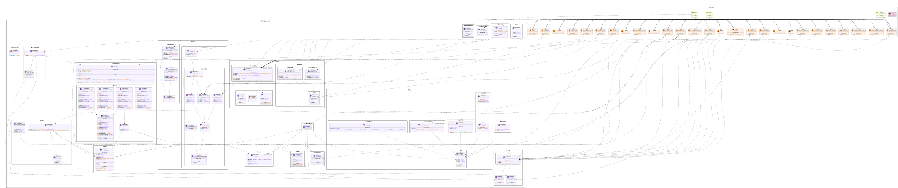

# MISP-frontend

## Setup

### Install

`npm install`

### MISP setup

#### Start instance

`npm run start:misp`
Instance will be running at: https://localhost

- Email: admin@admin.test
- Password: admin

#### generate your key here:

https://localhost/auth_keys/index

copy the template.env file to .env and replace the PUBLIC_MISP_KEY with your key

#### Update cors settings:

https://localhost/servers/serverSettings/Security

- search for Security.allow_cors and set to true. See: https://github.com/MISP/MISP/pull/4157
- also search for Security.cors_origins and set to \* for testing purposes

#### Multiple users / user roles

currently MISP has no api endpoint for /users/me => so we can not get the current user id, settings or role.
The Api should update this. For now we have a workaround in api/users/me that will get the userId from the auth_keys and load the userData with admin privileges.

Therefore you can update the PUBLIC_MISP_KEY to one with lower permissions but you have to set the SECRET_MISP_KEY_ADMIN to the key with full permissions.

For testing with admin permissions just set both vars to the key generated in the previous step.

## Develope

### Start misp instance to use as api

`npm run start:misp`
- Email: admin@admin.test
- Password: admin

### Start sveltekit

`npm run dev`

the frontend will run at: http://localhost:5173/

## Testing

### Unit tests (vitest)

`npm run test:unit`

### Component tests (cyprss)

`npm run test:open`

### integration tests (cyprss)

`npm run test:open`

### Storybook

#### Run

`npm run story:dev`

#### Build

`npm run story:build`

## Current UML Class Diagram

