---
header-includes:
  - \usepackage{fontspec}
  - '\directlua{luaotfload.add_fallback("emojifallback", {"NotoColorEmoji:mode=harf;"})}'
  - |
    ```{=latex}
    \setmainfont{FrutigerLT45Light}[RawFeature={fallback=emojifallback}]
    ```

---
# Routes & Components

## Td (Component) {#src-lib-components-modularTable-Td-svelte-ts}

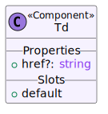

### Props

#### href: `string | undefined`{.typescript}

### Slots

#### default

## Table (Component) {#src-lib-components-modularTable-Table-svelte-js}

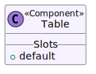

### Slots

#### default

## Th (Component) {#src-lib-components-modularTable-Th-svelte-ts}

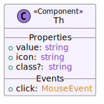

### Props

#### value: `string`{.typescript}

#### icon: `string`{.typescript}

#### class: `string | undefined`{.typescript}

### Events

#### click: `MouseEvent`

## DynTable (Component) {#src-lib-components-dynTable-DynTable-svelte-ts}

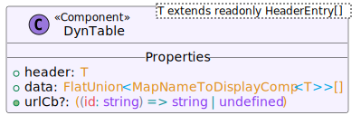

### Props

`<T extends readonly HeaderEntry[]>`

#### header: `T`{.typescript}

#### data: `FlatUnion<MapNameToDisplayComp<T>>[]`{.typescript}

#### urlCb: `((id: string) => string | undefined) | undefined`{.typescript}

## Info (Component) {#src-lib-components-info-Info-svelte-ts}

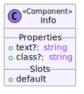

### Props

#### text: `string | undefined`{.typescript}

#### class: `string | undefined`{.typescript}

### Slots

#### default

## Pill (Component) {#src-lib-components-pill-Pill-svelte-ts}

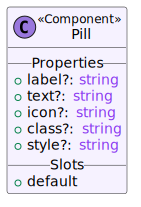

### Props

#### label: `string | undefined`{.typescript}

#### text: `string | undefined`{.typescript}

#### icon: `string | undefined`{.typescript}

#### class: `string | undefined`{.typescript}

#### style: `string | undefined`{.typescript}

### Slots

#### default

## DistributionPill (Component) {#src-lib-components-distributionPill-DistributionPill-svelte-ts}

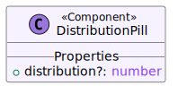

### Props

#### distribution: `number | undefined`{.typescript}

## PillCollection (Component) {#src-lib-components-pill-PillCollection-svelte-ts}

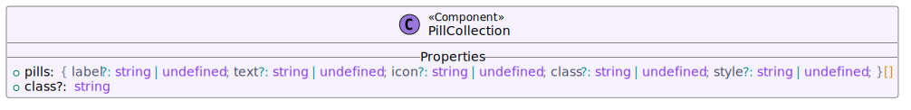

### Props

#### pills: `{ label?: string | undefined; text?: string | undefined; icon?: string | undefined; class?: string | undefined; style?: string | undefined; }[]`{.typescript}

#### class: `string | undefined`{.typescript}

## Boolean (Component) {#src-lib-components-boolean-Boolean-svelte-ts}


### Props

#### isTrue: `string | boolean | undefined`{.typescript}

#### class: `string | undefined`{.typescript}

## PillNavigation (Component) {#src-lib-components-pillNavigation-PillNavigation-svelte-ts}

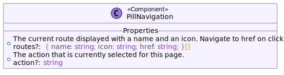

### Props

#### routes: `{ name: string; icon: string; href: string; }[] | undefined`{.typescript}

The current route displayed with a name and an icon. Navigate to href on click

#### action: `string | undefined`{.typescript}

The action that is currently selected for this page.

## Button (Component) {#src-lib-components-button-Button-svelte-ts}

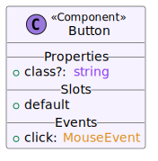

### Props

#### class: `string | undefined`{.typescript}

### Slots

#### default

### Events

#### click: `MouseEvent`

## Card (Component) {#src-lib-components-card-Card-svelte-js}

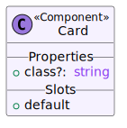

### Props

#### class: `string | undefined`{.typescript}

### Slots

#### default

## CardRow (Component) {#src-lib-components-card-CardRow-svelte-js}

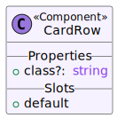

### Props

#### class: `string | undefined`{.typescript}

### Slots

#### default

## Checkbox (Component) {#src-lib-components-checkbox-Checkbox-svelte-ts}


### Props

#### checked: `boolean`{.typescript}

### Events

#### change: `Event`

## DatePill (Component) {#src-lib-components-pill-DatePill-svelte-ts}

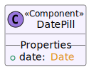

### Props

#### date: `Date`{.typescript}

## Select (Component) {#src-lib-components-form-Select-svelte-ts}

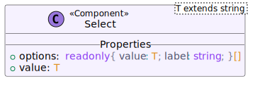

### Props

`<T extends string>`

#### options: `readonly { value: T; label: string; }[]`{.typescript}

#### value: `T`{.typescript}

## Input (Component) {#src-lib-components-input-Input-svelte-ts}

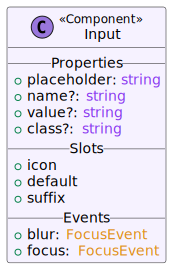

### Props

#### placeholder: `string`{.typescript}

#### name: `string | undefined`{.typescript}

#### value: `string | undefined`{.typescript}

#### class: `string | undefined`{.typescript}

### Slots

#### icon

#### default

#### suffix

### Events

#### blur: `FocusEvent`

#### focus: `FocusEvent`

## TopMenu (Component) {#src-lib-components-menus-topmenu-TopMenu-svelte-ts}

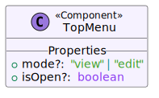

### Props

#### mode: `"view" | "edit" | undefined`{.typescript}

#### isOpen: `boolean | undefined`{.typescript}

## SideMenuDivider (Component) {#src-lib-components-menus-sidemenu-SideMenuDivider-svelte-js}

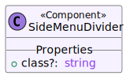

### Props

#### class: `string | undefined`{.typescript}

## SideMenuEntry (Component) {#src-lib-components-menus-sidemenu-SideMenuEntry-svelte-ts}

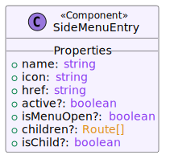

### Props

#### name: `string`{.typescript}

#### icon: `string`{.typescript}

#### href: `string`{.typescript}

#### active: `boolean | undefined`{.typescript}

#### isMenuOpen: `boolean | undefined`{.typescript}

#### children: `Route[] | undefined`{.typescript}

#### isChild: `boolean | undefined`{.typescript}

## SideMenu (Component) {#src-lib-components-menus-sidemenu-SideMenu-svelte-ts}

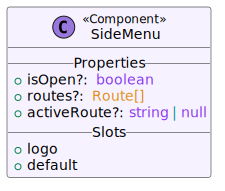

### Props

#### isOpen: `boolean | undefined`{.typescript}

#### routes: `Route[] | undefined`{.typescript}

#### activeRoute: `string | null | undefined`{.typescript}

### Slots

#### logo

#### default

## Layout (Component) {#src-lib-components-layout-Layout-svelte-ts}


### Props

#### routes: `{ name: string; icon: string; href: string; }[] | undefined`{.typescript}

#### currentRoute: `{ name: string; icon: string; href: string; }[] | undefined`{.typescript}

#### currentAction: `string | undefined`{.typescript}

### Slots

#### sideMenu

#### default

## / (Error) {#src-routes--error-svelte-js}

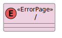

## / (Layout) {#src-routes--layout-svelte-ts}

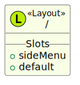

### Slots

#### sideMenu

#### default

## / (Page) {#src-routes--page-svelte-js}

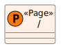

## /admin/keys (Page) {#src-routes-admin-keys--page-svelte-js}

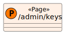

## /admin/keys/[id]/edit (Page) {#src-routes-admin-keys-[id]-edit--page-svelte-js}

![UML Representation of /admin/keys/[id]/edit](src/routes/admin/keys/[id]/edit/+page.svelte.js.svg)

## /admin/keys/[id]/view (Page) {#src-routes-admin-keys-[id]-view--page-svelte-js}

![UML Representation of /admin/keys/[id]/view](src/routes/admin/keys/[id]/view/+page.svelte.js.svg)

## /admin/keys/list (Page) {#src-routes-admin-keys-list--page-svelte-ts}

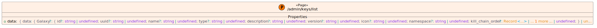

### Props

#### data: `{ data: { Galaxy?: { id?: string | undefined; uuid?: string | undefined; name?: string | undefined; type?: string | undefined; description?: string | undefined; version?: string | undefined; icon?: string | undefined; namespace?: string | undefined; kill_chain_order?: Record<...> | ... 1 more ... | undefined; } | un...`{.typescript}

## /admin/servers (Page) {#src-routes-admin-servers--page-svelte-js}

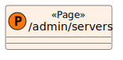

## /admin/servers/[id]/edit (Page) {#src-routes-admin-servers-[id]-edit--page-svelte-js}

![UML Representation of /admin/servers/[id]/edit](src/routes/admin/servers/[id]/edit/+page.svelte.js.svg)

## /admin/servers/[id]/view (Page) {#src-routes-admin-servers-[id]-view--page-svelte-js}

![UML Representation of /admin/servers/[id]/view](src/routes/admin/servers/[id]/view/+page.svelte.js.svg)

## /admin/servers/list (Page) {#src-routes-admin-servers-list--page-svelte-ts}

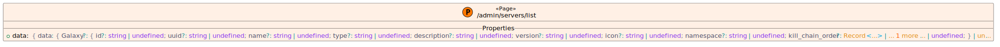

### Props

#### data: `{ data: { Galaxy?: { id?: string | undefined; uuid?: string | undefined; name?: string | undefined; type?: string | undefined; description?: string | undefined; version?: string | undefined; icon?: string | undefined; namespace?: string | undefined; kill_chain_order?: Record<...> | ... 1 more ... | undefined; } | un...`{.typescript}

## /admin/users (Page) {#src-routes-admin-users--page-svelte-js}

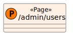

## /admin/users/[id]/edit (Page) {#src-routes-admin-users-[id]-edit--page-svelte-js}

![UML Representation of /admin/users/[id]/edit](src/routes/admin/users/[id]/edit/+page.svelte.js.svg)

## /admin/users/[id]/view (Page) {#src-routes-admin-users-[id]-view--page-svelte-js}

![UML Representation of /admin/users/[id]/view](src/routes/admin/users/[id]/view/+page.svelte.js.svg)

## /admin/users/list (Page) {#src-routes-admin-users-list--page-svelte-ts}

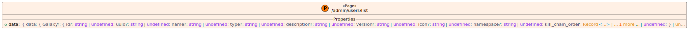

### Props

#### data: `{ data: { Galaxy?: { id?: string | undefined; uuid?: string | undefined; name?: string | undefined; type?: string | undefined; description?: string | undefined; version?: string | undefined; icon?: string | undefined; namespace?: string | undefined; kill_chain_order?: Record<...> | ... 1 more ... | undefined; } | un...`{.typescript}

## /event (Page) {#src-routes-event--page-svelte-js}


## /event/[id]/edit (Page) {#src-routes-event-[id]-edit--page-svelte-ts}

![UML Representation of /event/[id]/edit](src/routes/event/[id]/edit/+page.svelte.ts.svg)

## /event/[id]/view (Page) {#src-routes-event-[id]-view--page-svelte-ts}

![UML Representation of /event/[id]/view](src/routes/event/[id]/view/+page.svelte.ts.svg)

## /event/list (Page) {#src-routes-event-list--page-svelte-ts}

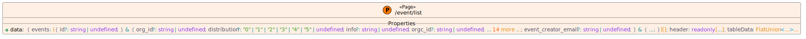

### Props

#### data: `{ events: ({ id?: string | undefined; } & { org_id?: string | undefined; distribution?: "0" | "1" | "2" | "3" | "4" | "5" | undefined; info?: string | undefined; orgc_id?: string | undefined; ... 14 more ...; event_creator_email?: string | undefined; } & { ...; })[]; header: readonly [...]; tableData: FlatUnion<...>...`{.typescript}

## /galaxy (Page) {#src-routes-galaxy--page-svelte-js}


## /galaxy/[id]/edit (Page) {#src-routes-galaxy-[id]-edit--page-svelte-ts}

![UML Representation of /galaxy/[id]/edit](src/routes/galaxy/[id]/edit/+page.svelte.ts.svg)

## /galaxy/[id]/view (Page) {#src-routes-galaxy-[id]-view--page-svelte-ts}

![UML Representation of /galaxy/[id]/view](src/routes/galaxy/[id]/view/+page.svelte.ts.svg)

### Props

#### data: `{ galaxy: { Galaxy?: { id?: string | undefined; uuid?: string | undefined; name?: string | undefined; type?: string | undefined; description?: string | undefined; version?: string | undefined; icon?: string | undefined; namespace?: string | undefined; kill_chain_order?: Record<...> | ... 1 more ... | undefined; } | ...`{.typescript}

## /galaxy/list (Page) {#src-routes-galaxy-list--page-svelte-ts}

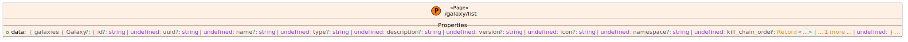

### Props

#### data: `{ galaxies: { Galaxy?: { id?: string | undefined; uuid?: string | undefined; name?: string | undefined; type?: string | undefined; description?: string | undefined; version?: string | undefined; icon?: string | undefined; namespace?: string | undefined; kill_chain_order?: Record<...> | ... 1 more ... | undefined; } ...`{.typescript}

## SettingsEntry (Component) {#src-routes-settings-SettingsEntry-svelte-ts}

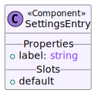

### Props

#### label: `string`{.typescript}

### Slots

#### default

## /settings (Page) {#src-routes-settings--page-svelte-ts}

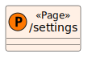

## /tags (Page) {#src-routes-tags--page-svelte-js}

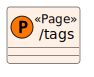

## /tags/[id]/edit (Page) {#src-routes-tags-[id]-edit--page-svelte-js}

![UML Representation of /tags/[id]/edit](src/routes/tags/[id]/edit/+page.svelte.js.svg)

## /tags/[id]/view (Page) {#src-routes-tags-[id]-view--page-svelte-js}

![UML Representation of /tags/[id]/view](src/routes/tags/[id]/view/+page.svelte.js.svg)

## /tags/list (Page) {#src-routes-tags-list--page-svelte-ts}

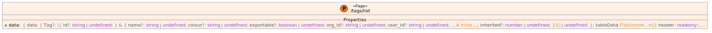

### Props

#### data: `{ data: { Tag?: ({ id?: string | undefined; } & { name?: string | undefined; colour?: string | undefined; exportable?: boolean | undefined; org_id?: string | undefined; user_id?: string | undefined; ... 4 more ...; inherited?: number | undefined; })[] | undefined; }; tableData: FlatUnion<...>[]; header: readonly [.....`{.typescript}

## /workflow/modules (Page) {#src-routes-workflow-modules--page-svelte-js}

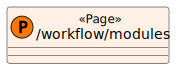

## /workflow/modules/[id]/edit (Page) {#src-routes-workflow-modules-[id]-edit--page-svelte-js}

![UML Representation of /workflow/modules/[id]/edit](src/routes/workflow/modules/[id]/edit/+page.svelte.js.svg)

## /workflow/modules/[id]/view (Page) {#src-routes-workflow-modules-[id]-view--page-svelte-js}

![UML Representation of /workflow/modules/[id]/view](src/routes/workflow/modules/[id]/view/+page.svelte.js.svg)

## /workflow/modules/list (Page) {#src-routes-workflow-modules-list--page-svelte-ts}

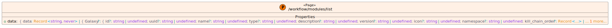

### Props

#### data: `{ data: Record<string, never> | { Galaxy?: { id?: string | undefined; uuid?: string | undefined; name?: string | undefined; type?: string | undefined; description?: string | undefined; version?: string | undefined; icon?: string | undefined; namespace?: string | undefined; kill_chain_order?: Record<...> | ... 1 more...`{.typescript}

## /workflow/trigger (Page) {#src-routes-workflow-trigger--page-svelte-js}

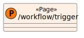

## /workflow/trigger/[id]/edit (Page) {#src-routes-workflow-trigger-[id]-edit--page-svelte-js}

![UML Representation of /workflow/trigger/[id]/edit](src/routes/workflow/trigger/[id]/edit/+page.svelte.js.svg)

## CustomNode (Component) {#src-routes-workflow-trigger-[id]-view-CustomNode-svelte-ts}

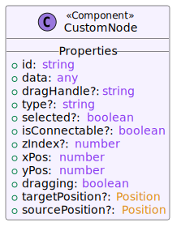

### Props

#### id: `string`{.typescript}

#### data: `any`{.typescript}

#### dragHandle: `string | undefined`{.typescript}

#### type: `string | undefined`{.typescript}

#### selected: `boolean | undefined`{.typescript}

#### isConnectable: `boolean | undefined`{.typescript}

#### zIndex: `number | undefined`{.typescript}

#### xPos: `number`{.typescript}

#### yPos: `number`{.typescript}

#### dragging: `boolean`{.typescript}

#### targetPosition: `Position | undefined`{.typescript}

#### sourcePosition: `Position | undefined`{.typescript}

## /workflow/trigger/[id]/view (Page) {#src-routes-workflow-trigger-[id]-view--page-svelte-ts}

![UML Representation of /workflow/trigger/[id]/view](src/routes/workflow/trigger/[id]/view/+page.svelte.ts.svg)

## /workflow/trigger/list (Page) {#src-routes-workflow-trigger-list--page-svelte-ts}

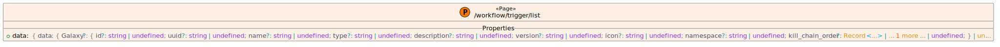

### Props

#### data: `{ data: { Galaxy?: { id?: string | undefined; uuid?: string | undefined; name?: string | undefined; type?: string | undefined; description?: string | undefined; version?: string | undefined; icon?: string | undefined; namespace?: string | undefined; kill_chain_order?: Record<...> | ... 1 more ... | undefined; } | un...`{.typescript}

