# Components

## Td

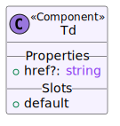

### Props

#### href: `string | undefined`

### Slots

#### default

## Table

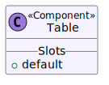

### Slots

#### default

## Th

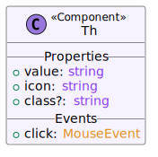

### Props

#### value: `string`

#### icon: `string`

#### class: `string | undefined`

### Events

#### click: `MouseEvent`

## DynTable

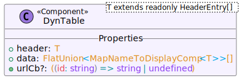

### Props

T extends readonly HeaderEntry\[]

#### header: `T`

#### data: `FlatUnion<MapNameToDisplayComp<T>>[]`

#### urlCb: `((id: string) => string | undefined) | undefined`

## Info

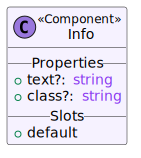

### Props

#### text: `string | undefined`

#### class: `string | undefined`

### Slots

#### default

## Pill

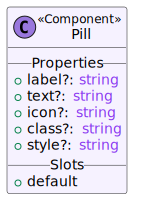

### Props

#### label: `string | undefined`

#### text: `string | undefined`

#### icon: `string | undefined`

#### class: `string | undefined`

#### style: `string | undefined`

### Slots

#### default

## DistributionPill

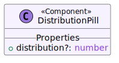

### Props

#### distribution: `number | undefined`

## PillCollection

### Props

#### pills: `{ label?: string | undefined; text?: string | undefined; icon?: string | undefined; class?: string | undefined; style?: string | undefined; }[]`

#### class: `string | undefined`

## Boolean

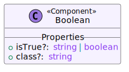

### Props

#### isTrue: `string | boolean | undefined`

#### class: `string | undefined`

## PillNavigation

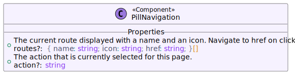

### Props

#### routes: `{ name: string; icon: string; href: string; }[] | undefined`

#### action: `string | undefined`

## Button

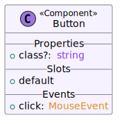

### Props

#### class: `string | undefined`

### Slots

#### default

### Events

#### click: `MouseEvent`

## Card

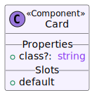

### Props

#### class: `string | undefined`

### Slots

#### default

## CardRow

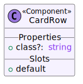

### Props

#### class: `string | undefined`

### Slots

#### default

## Checkbox

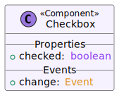

### Props

#### checked: `boolean`

### Events

#### change: `Event`

## DatePill

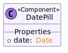

### Props

#### date: `Date`

## Select

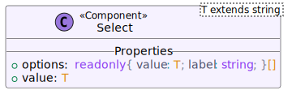

### Props

T extends string

#### options: `readonly { value: T; label: string; }[]`

#### value: `T`

## Input

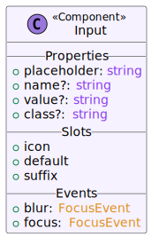

### Props

#### placeholder: `string`

#### name: `string | undefined`

#### value: `string | undefined`

#### class: `string | undefined`

### Slots

#### icon

#### default

#### suffix

### Events

#### blur: `FocusEvent`

#### focus: `FocusEvent`

## TopMenu

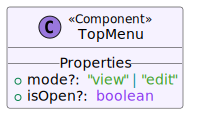

### Props

#### mode: `"view" | "edit" | undefined`

#### isOpen: `boolean | undefined`

## SideMenuDivider

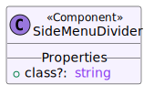

### Props

#### class: `string | undefined`

## SideMenuEntry

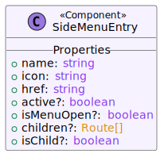

### Props

#### name: `string`

#### icon: `string`

#### href: `string`

#### active: `boolean | undefined`

#### isMenuOpen: `boolean | undefined`

#### children: `Route[] | undefined`

#### isChild: `boolean | undefined`

## SideMenu

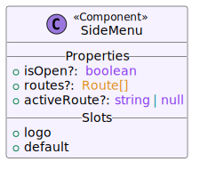

### Props

#### isOpen: `boolean | undefined`

#### routes: `Route[] | undefined`

#### activeRoute: `string | null | undefined`

### Slots

#### logo

#### default

## Layout

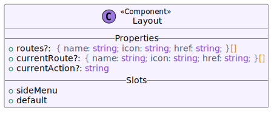

### Props

#### routes: `{ name: string; icon: string; href: string; }[] | undefined`

#### currentRoute: `{ name: string; icon: string; href: string; }[] | undefined`

#### currentAction: `string | undefined`

### Slots

#### sideMenu

#### default

## SettingsEntry

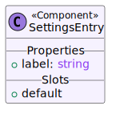

### Props

#### label: `string`

### Slots

#### default

## CustomNode

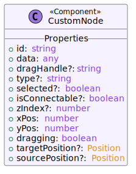

### Props

#### id: `string`

#### data: `any`

#### dragHandle: `string | undefined`

#### type: `string | undefined`

#### selected: `boolean | undefined`

#### isConnectable: `boolean | undefined`

#### zIndex: `number | undefined`

#### xPos: `number`

#### yPos: `number`

#### dragging: `boolean`

#### targetPosition: `Position | undefined`

#### sourcePosition: `Position | undefined`

