# Pages

## /

## /admin/keys

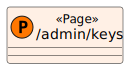

## /admin/keys/\[id]/edit

![UML Representation of /admin/keys/\[id\]/edit](src/routes/admin/keys/[id]/edit/+page.svelte.svg)

## /admin/keys/\[id]/view

![UML Representation of /admin/keys/\[id\]/view](src/routes/admin/keys/[id]/view/+page.svelte.svg)

## /admin/keys/list

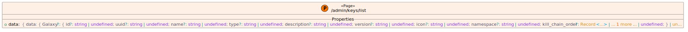

### Props

#### data: `{ data: { Galaxy?: { id?: string | undefined; uuid?: string | undefined; name?: string | undefined; type?: string | undefined; description?: string | undefined; version?: string | undefined; icon?: string | undefined; namespace?: string | undefined; kill_chain_order?: Record<...> | ... 1 more ... | undefined; } | un...`

## /admin/servers

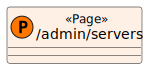

## /admin/servers/\[id]/edit

![UML Representation of /admin/servers/\[id\]/edit](src/routes/admin/servers/[id]/edit/+page.svelte.svg)

## /admin/servers/\[id]/view

![UML Representation of /admin/servers/\[id\]/view](src/routes/admin/servers/[id]/view/+page.svelte.svg)

## /admin/servers/list

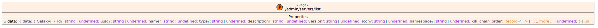

### Props

#### data: `{ data: { Galaxy?: { id?: string | undefined; uuid?: string | undefined; name?: string | undefined; type?: string | undefined; description?: string | undefined; version?: string | undefined; icon?: string | undefined; namespace?: string | undefined; kill_chain_order?: Record<...> | ... 1 more ... | undefined; } | un...`

## /admin/users

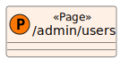

## /admin/users/\[id]/edit

![UML Representation of /admin/users/\[id\]/edit](src/routes/admin/users/[id]/edit/+page.svelte.svg)

## /admin/users/\[id]/view

![UML Representation of /admin/users/\[id\]/view](src/routes/admin/users/[id]/view/+page.svelte.svg)

## /admin/users/list

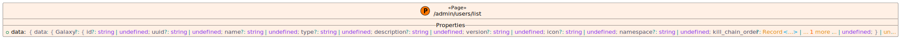

### Props

#### data: `{ data: { Galaxy?: { id?: string | undefined; uuid?: string | undefined; name?: string | undefined; type?: string | undefined; description?: string | undefined; version?: string | undefined; icon?: string | undefined; namespace?: string | undefined; kill_chain_order?: Record<...> | ... 1 more ... | undefined; } | un...`

## /event

## /event/\[id]/edit

![UML Representation of /event/\[id\]/edit](src/routes/event/[id]/edit/+page.svelte.svg)

## /event/\[id]/view

![UML Representation of /event/\[id\]/view](src/routes/event/[id]/view/+page.svelte.svg)

## /event/list

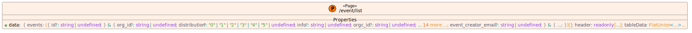

### Props

#### data: `{ events: ({ id?: string | undefined; } & { org_id?: string | undefined; distribution?: "0" | "1" | "2" | "3" | "4" | "5" | undefined; info?: string | undefined; orgc_id?: string | undefined; ... 14 more ...; event_creator_email?: string | undefined; } & { ...; })[]; header: readonly [...]; tableData: FlatUnion<...>...`

## /galaxy

## /galaxy/\[id]/edit

![UML Representation of /galaxy/\[id\]/edit](src/routes/galaxy/[id]/edit/+page.svelte.svg)

## /galaxy/\[id]/view

![UML Representation of /galaxy/\[id\]/view](src/routes/galaxy/[id]/view/+page.svelte.svg)

### Props

#### data: `{ galaxy: { Galaxy?: { id?: string | undefined; uuid?: string | undefined; name?: string | undefined; type?: string | undefined; description?: string | undefined; version?: string | undefined; icon?: string | undefined; namespace?: string | undefined; kill_chain_order?: Record<...> | ... 1 more ... | undefined; } | ...`

## /galaxy/list

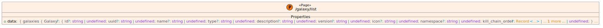

### Props

#### data: `{ galaxies: { Galaxy?: { id?: string | undefined; uuid?: string | undefined; name?: string | undefined; type?: string | undefined; description?: string | undefined; version?: string | undefined; icon?: string | undefined; namespace?: string | undefined; kill_chain_order?: Record<...> | ... 1 more ... | undefined; } ...`

## /settings

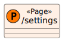

## /tags

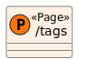

## /tags/\[id]/edit

![UML Representation of /tags/\[id\]/edit](src/routes/tags/[id]/edit/+page.svelte.svg)

## /tags/\[id]/view

![UML Representation of /tags/\[id\]/view](src/routes/tags/[id]/view/+page.svelte.svg)

## /tags/list

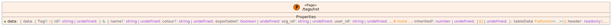

### Props

#### data: `{ data: { Tag?: ({ id?: string | undefined; } & { name?: string | undefined; colour?: string | undefined; exportable?: boolean | undefined; org_id?: string | undefined; user_id?: string | undefined; ... 4 more ...; inherited?: number | undefined; })[] | undefined; }; tableData: FlatUnion<...>[]; header: readonly [.....`

## /workflow/modules

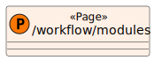

## /workflow/modules/\[id]/edit

![UML Representation of /workflow/modules/\[id\]/edit](src/routes/workflow/modules/[id]/edit/+page.svelte.svg)

## /workflow/modules/\[id]/view

![UML Representation of /workflow/modules/\[id\]/view](src/routes/workflow/modules/[id]/view/+page.svelte.svg)

## /workflow/modules/list

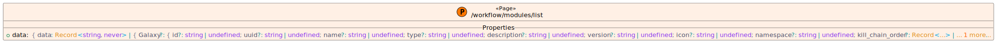

### Props

#### data: `{ data: Record<string, never> | { Galaxy?: { id?: string | undefined; uuid?: string | undefined; name?: string | undefined; type?: string | undefined; description?: string | undefined; version?: string | undefined; icon?: string | undefined; namespace?: string | undefined; kill_chain_order?: Record<...> | ... 1 more...`

## /workflow/trigger

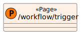

## /workflow/trigger/\[id]/edit

![UML Representation of /workflow/trigger/\[id\]/edit](src/routes/workflow/trigger/[id]/edit/+page.svelte.svg)

## /workflow/trigger/\[id]/view

![UML Representation of /workflow/trigger/\[id\]/view](src/routes/workflow/trigger/[id]/view/+page.svelte.svg)

## /workflow/trigger/list

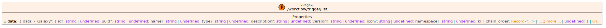

### Props

#### data: `{ data: { Galaxy?: { id?: string | undefined; uuid?: string | undefined; name?: string | undefined; type?: string | undefined; description?: string | undefined; version?: string | undefined; icon?: string | undefined; namespace?: string | undefined; kill_chain_order?: Record<...> | ... 1 more ... | undefined; } | un...`
