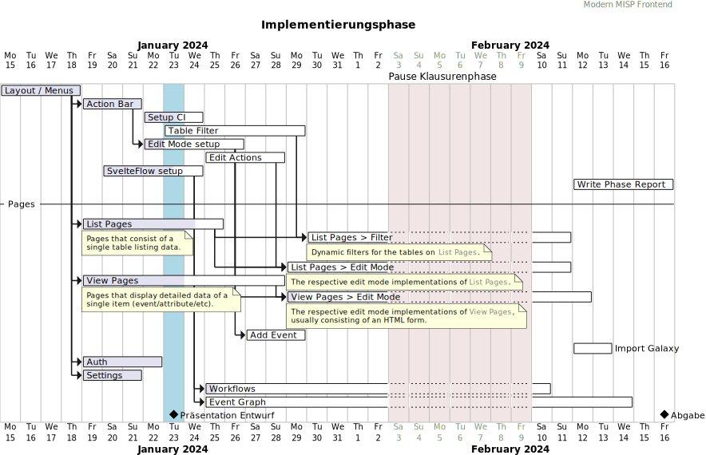
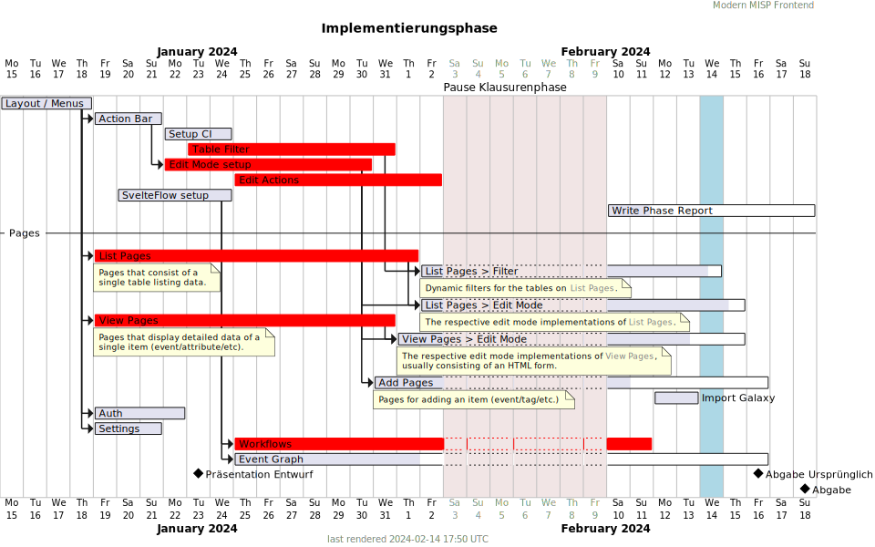
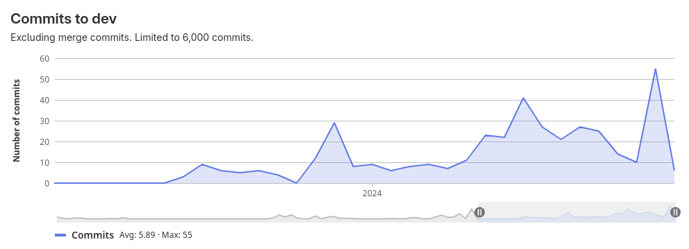

# Ablauf und Verzögerungen im Zeitplan

In diesem Abschnitt wird der Verlauf der Phase analysiert.

### Ursprünglicher Plan

### Tatsächlicher Verlauf

An einigen Stellen konnte unser Zeitplan leider nicht wie vorgesehen eingehalten werden.

Rote Balken symbolisieren, dass die entsprechende Aufgabe nicht zum geplanten Zeitpunkt vollständig abgeschlossen war.

## Erste Phasenhälfte

Gerade in den ersten 1-2 Wochen ist die Implementierungsarbeit nur langsam in gang gekommen.

### Planung

Die erste Woche war noch geprägt von der Vorbereitung der Entwurfspräsentation, sowie Planung der Implementierungsphase.
In dieser Zeit ist das ursprüngliche Gantt-Diagramm entstanden.

Da wir die grundlegende Projektstruktur und einzelne Teile der Funktionalität bereits in der Entwurfsphase umgesetzt hatten, lagen wir zu diesem Zeitpunkt noch recht gut im Zeitplan.

### Start der Implementierung

TODO: view mode und edit mode setup

## Zweite Phasenhälfte

TODO: edit mode, filter, API Probleme

### Endspurt

TODO
