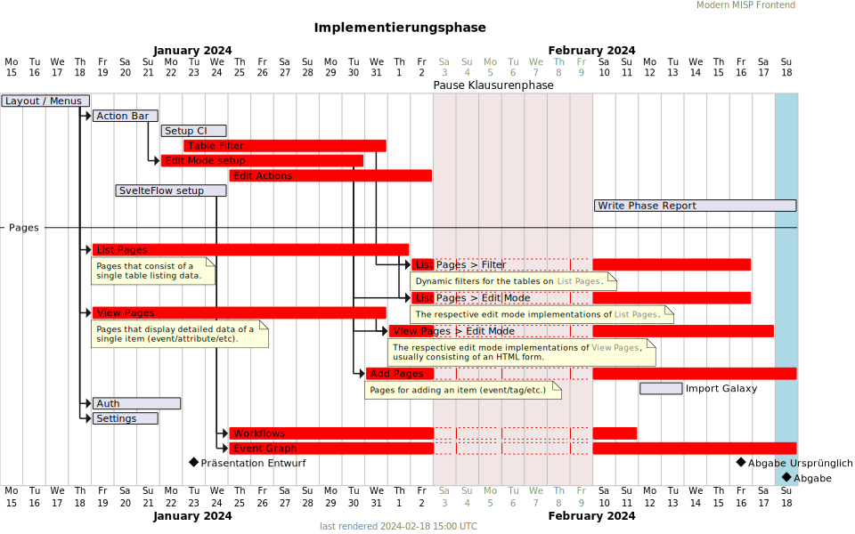

# Ablauf und Verzögerungen im Zeitplan

In diesem Abschnitt wird der Verlauf der Phase analysiert.

### Ursprünglicher Plan

### Tatsächlicher Verlauf

An einigen Stellen konnte unser Zeitplan leider nicht wie vorgesehen eingehalten werden.

Rote Balken symbolisieren, dass die entsprechende Aufgabe nicht zum geplanten Zeitpunkt vollständig abgeschlossen war.

## Erste Phasenhälfte

Gerade in den ersten 1-2 Wochen ist die Implementierungsarbeit nur langsam in gang gekommen.

### Planung

Die erste Woche war noch geprägt von der Vorbereitung der Entwurfspräsentation, sowie Planung der Implementierungsphase.
In dieser Zeit ist das ursprüngliche Gantt-Diagramm entstanden.

Da wir die grundlegende Projektstruktur und einzelne Teile der Funktionalität bereits in der Entwurfsphase umgesetzt hatten, lagen wir zu diesem Zeitpunkt noch recht gut im Zeitplan.

### Start der Implementierung

Die Verzögerungen am Anfang haben leider dazu geführt,
dass sich auch der Beginn von darauffolgenden Aufgaben verzögert hat.

#### View mode

Bei den Seiten für den view mode gab es keine größeren Probleme,
allerdings hat die Implementierung trotzdem etwas länger gedauert als geplant.

#### Workflows

Bei den Workflows hat es Anfangs Zeit gekostet,
sich in [SvelteFlow](https://svelteflow.dev/),
die von uns verwendete Bibliothek zum realisieren das graphischen Editors,
einzuarbeiten.

## Zweite Phasenhälfte

### API Probleme

Besonders als es an die Implementierung des edit mode und der Filter ging,
haben sich die Probleme mit der MISP API bemerkbar gemacht.

Die teils falsche und unvollständige API Spezifikation,
sowie inkonsistentes Verhalten und wenig aussagende oder irreführende
Error-Nachrichten der API haben uns viel nicht eingeplante
Zeit und Mühen gekostet.

So mussten wir unter anderem API Endpoints "reverse-engineeren",
um sie richtig ansprechen zu können
und eigene Typen für deren Rückgabewerte definieren.

### Endspurt

In den letzten paar Tagen haben wir nochmal besonders viel gearbeitet,
da die Zeit knapp wurde und wir noch alles fertig bekommen wollten.
