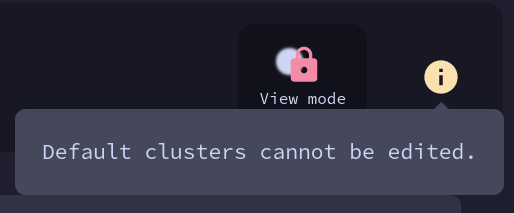

# Änderungen an Design und Entwurf

## Workflows

Ursprünglich war geplant, Workflows in der Trigger-Ansicht anzuzeigen.

Stattdessen entschieden wir uns dazu, Workflows in einer eigenen Liste mit jeweils einer eigenen View Page darzustellen.
Dort findet sich auch der grafische Editor.

## Benennung Eigenschaften

Einigen Eigenschaften wurden zur intuitiven Benutzbarkeit umbenannt.

## Auswahl dargestellter Eigenschaften

Eigenschaften, die sich im Laufe der Programmierung als überflüssig herausgestellt hatten,
wurden entfernt, z. B. bei der Attributliste die Angabe der Organisation, da sie bereits durch das Event definiert war.
Parallel dazu wurden andere sinnvollere Eigenschaften hinzugefügt.

### Entfernen Dopplung

Einige Kategorien, zum Beispiel Nutzername und Nutzer-E-Mail, sind immer identisch, weshalb nur eine beider Kategorien dargestellt wird.

## Warnungen

Es werden keine Warnungen angezeigt, wenn keine Attribute oder Tags hinzugefügt worden sind.

## Neu hinzugefügt

An einigen Stellen bot es sich an, neue Elemente zum Design hinzuzufügen, um die UX zu verbessern.

### Mode lock

Das Umschalten zwischen View und Edit Mode wird in bestimmen Fällen gesperrt.

### Context info

In bestimmten Fällen ist es für den Nutzer hilfreich, kontextuelle Informationen zu erhalten,
zum Beispiel, wenn sich die Oberfläche anders als gewöhnlich verhält.

Diese zusätzlichen Informationen können im oberen Menü
rechts neben der Aktionsleiste
mit einem Klick auf das Info-Symbol eingesehen werden.

Das Symbol ist standardmäßig hellgrau und wird farbig,
wenn für den aktuellen Kontext Informationen zur Verfügung stehen.

## Aktionsleiste vs. Schnellaktionen

Einige Funktionen wurden zwischen Aktions- und Schnellaktionsleiste getauscht. Ebenso erwiesen sich manche Schnellaktionen, insbesondere die Aktion 'Edit', in der Implementierung als überflüssig und wurden somit nicht implementiert.

## Contact Reporter

Statt einer separaten Funktionalität kann der Nutzer auf die E-Mail-Adresse des Erstellers klicken und die gewünschte Nachricht per E-Mail senden.

## Tabellenspalten

Die dargestellten Spalten bei Tabellendarstellungen sind nicht individuell auswählbar.

## Links

An einigen Stellen (z. B. /admin/keys/) enthält 'email' einen Link zum Nutzer (in /users/[id]), anstatt das E-Mail-Programm zu öffnen.

