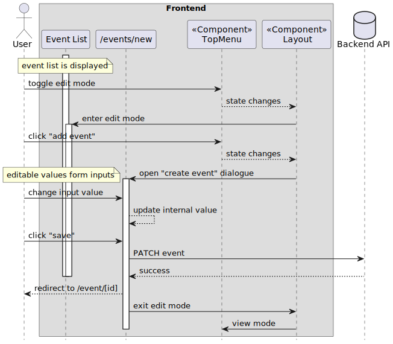
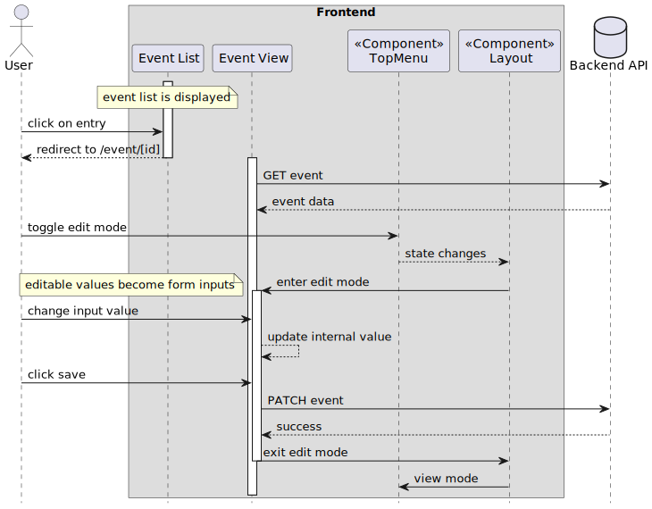
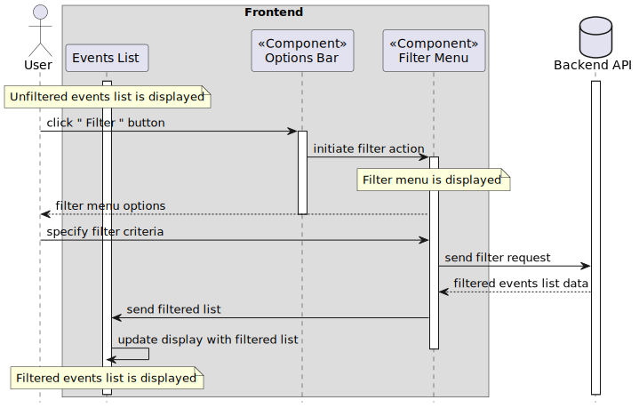
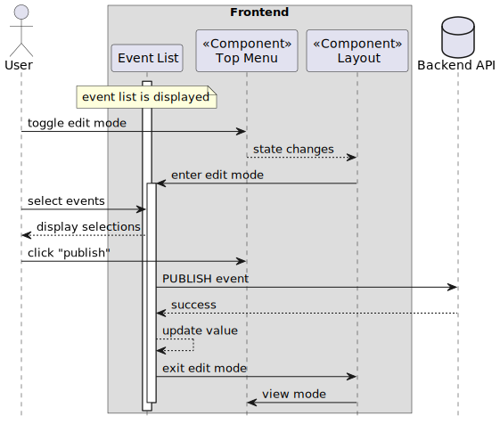
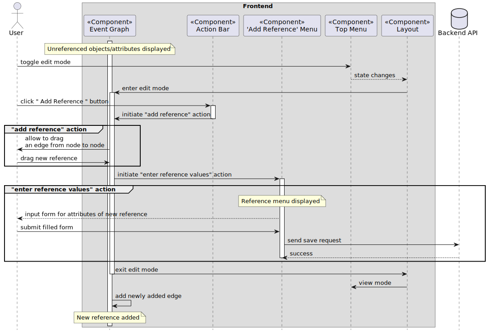
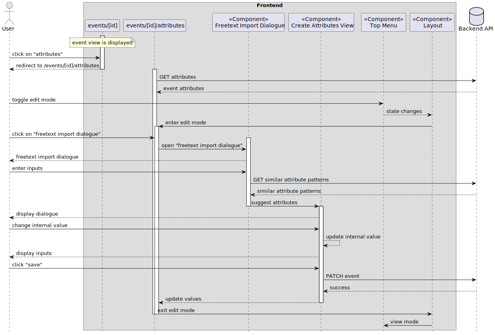

# Sequence Diagrams

## Add Event

Description: Adding a new event to the Events-List

## Edit Event

Description: desc_placeholder

## Filter Events

Description: Filtering events of the Events-List according to some given criteria

## Publish Event

Description: desc_placeholder

## Add Reference

Description: Adding a new reference between an object and attribute in an Event-Graph

## Freetext Import

Description: desc_placeholder

